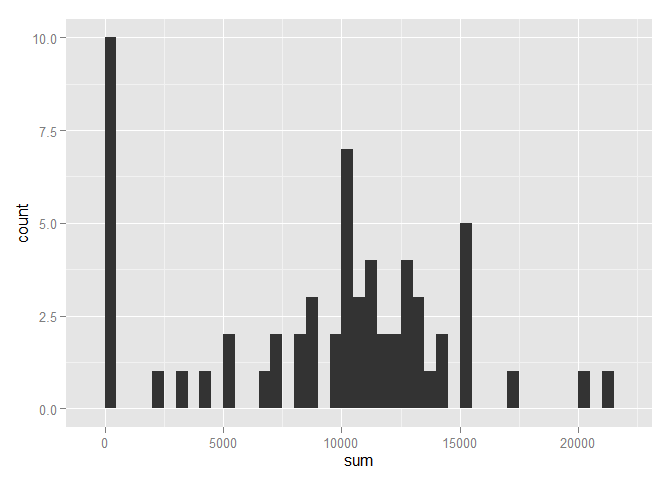
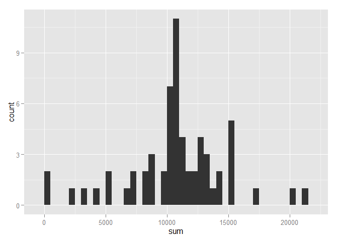

# Reproducible Research: Peer Assessment 1


## Loading and preprocessing the data
### 1. Getting the data:
In order to guarantee the source data is consistent with the analysis performed in this analysis, the existance of the source dataset is checked as well as the compressed file used as a mean of delivery. If the source dataset is not found, it is downloaded from the assaigment webpage and decompressed.
    

```r
file_url='https://d396qusza40orc.cloudfront.net/repdata%2Fdata%2Factivity.zip'

if(!file.exists("./activity.csv")){    
    if(!file.exists("./activity.zip")){    
        download.file(file_url, destfile="./activity.zip")
        unzip("./activity.zip",exdir=".")  
        }else{    
            unzip("./activity.zip",exdir=".")
            }
    }
```

There are three packages necessary to process the dataset: Lubridate, plyr and ggplot2. The following code checks that the packages are installed and loaded:


```r
is.installed <- function(pck = NULL){  
    installed_pck <- as.character(rownames(installed.packages()))    
    if(is.null(pck)){       
        installed_pck        
        }else{           
            pck %in% installed_pck           
            }
    }

required<- c("lubridate", "plyr", "ggplot2")

for(i in required){
    if(is.installed(i)==T){       
        if(!is.element(i, .packages())) {
            library(i, character.only = T, quietly = T,  verbose = F)
            }
           }else{               
               install.packages(i, quiet = T,  verbose = F)
               library(i, character.only = T, quietly = T,  verbose = F)            
               }
    }
```

### 2. Preprocessing the data:

For ease of calculations, the date and interval variables are combined to produce a time variable POSIXct by using lubridate:
    

```r
steps <- as.data.frame(read.csv("activity.csv", stringsAsFactors=F))
steps$time <- paste(floor(steps$interval/100),round(((steps$interval/100)-floor(steps$interval/100))*100,0),sep=":")
steps$DateTime <- ymd_hms(paste( steps$date, steps$time, "00", sep=" "))
```

## What is mean total number of steps taken per day?

Using plyr to get the sum of steps per day (sum function ignores NA's):


```r
tot_steps <- ddply(steps, "date", summarize,
                sum = sum(steps, na.rm=T))

median <- median(tot_steps$sum)
mean <- mean(tot_steps$sum)
```

### 1. Histogram of the sum of steps per day:

```r
qplot(sum, data=tot_steps, binwidth=500)
```

 

### 2. Mean and Median:

The individual tracked in this dataset, takes on average 9354.2 steps per day. This distribution has a median value of 10395

## What is the average daily activity pattern?

Using plyr to summarize the average steps per time interval:

```r
ave_steps <- ddply(steps, "interval", summarize,
                ave = round(mean(steps, na.rm=T),2))
```

### 1. Time-Series plot of the averge number of steps per time interval: 

```r
plot(ave_steps$interval, ave_steps$ave, type = "l")
```

 

### 2. The time interval with most steps on average:

```r
max_interval <- ave_steps[ave_steps$ave==max(ave_steps$ave),"interval"]
max_interval <- paste(floor(max_interval/100),round(((max_interval/100)-floor(max_interval/100))*100,0), sep=":")
```

The individual being tracked in this datataset takes the largest amount of steps on average at 8:35. It is possible that the individual commutes using a bike or walking. It is also possible that he/she exercises as part of a morning routine.

## Imputing missing values

### 1. Number of NAs:


```r
steps$nas <- is.na(steps$steps)
tot_na <- sum(steps$nas)
```
The total number of NAs for the steps variable is 2304
    
### 2. Filling out the NAs:

The idea here is to fill out the NA's with the average number of steps for the corresponding time interval as observed in the global dataset:

```r
new_steps <- steps

for(k in seq_along(new_steps$nas)){
    if(new_steps$nas[k]==T){
        new_steps$steps[k] <- ave_steps[ave_steps$interval==new_steps$interval[k],"ave"]
        }
    }
new_steps$nas <- is.na(new_steps$steps)
```

### 3. The New Dataset:

The OLD dataset

```r
head(steps, 10)
```

```
##    steps       date interval time            DateTime  nas
## 1     NA 2012-10-01        0  0:0 2012-10-01 00:00:00 TRUE
## 2     NA 2012-10-01        5  0:5 2012-10-01 00:05:00 TRUE
## 3     NA 2012-10-01       10 0:10 2012-10-01 00:10:00 TRUE
## 4     NA 2012-10-01       15 0:15 2012-10-01 00:15:00 TRUE
## 5     NA 2012-10-01       20 0:20 2012-10-01 00:20:00 TRUE
## 6     NA 2012-10-01       25 0:25 2012-10-01 00:25:00 TRUE
## 7     NA 2012-10-01       30 0:30 2012-10-01 00:30:00 TRUE
## 8     NA 2012-10-01       35 0:35 2012-10-01 00:35:00 TRUE
## 9     NA 2012-10-01       40 0:40 2012-10-01 00:40:00 TRUE
## 10    NA 2012-10-01       45 0:45 2012-10-01 00:45:00 TRUE
```

The NEW dataset

```r
head(new_steps, 10)
```

```
##    steps       date interval time            DateTime   nas
## 1   1.72 2012-10-01        0  0:0 2012-10-01 00:00:00 FALSE
## 2   0.34 2012-10-01        5  0:5 2012-10-01 00:05:00 FALSE
## 3   0.13 2012-10-01       10 0:10 2012-10-01 00:10:00 FALSE
## 4   0.15 2012-10-01       15 0:15 2012-10-01 00:15:00 FALSE
## 5   0.08 2012-10-01       20 0:20 2012-10-01 00:20:00 FALSE
## 6   2.09 2012-10-01       25 0:25 2012-10-01 00:25:00 FALSE
## 7   0.53 2012-10-01       30 0:30 2012-10-01 00:30:00 FALSE
## 8   0.87 2012-10-01       35 0:35 2012-10-01 00:35:00 FALSE
## 9   0.00 2012-10-01       40 0:40 2012-10-01 00:40:00 FALSE
## 10  1.47 2012-10-01       45 0:45 2012-10-01 00:45:00 FALSE
```

### 4. Histogram of the new dataset:

```r
tot_new_steps <- ddply(new_steps, "date", summarize,
                       sum = sum(steps))

new_median <- median(tot_new_steps$sum)
new_mean <- round(mean(tot_new_steps$sum),2)

qplot(sum, data=tot_new_steps, binwidth=500)
```

 

The new dataset has a value for the mean steps taken in a day of 10766.18 and a median of 10766.13, which differs from the original values (mean:9354.23, median:10395) by 1411.95 and 371.13 steps respectively.
    
## Are there differences in activity patterns between weekdays and weekends?

### 1. A new factor variable:

Creating a factor variable with 2 levels: "weekday" & "weekend":

```r
new_steps$day <- wday(new_steps$DateTime,label=F)
new_steps$week <- "weekend"
new_steps[new_steps$day<=5,"week"] <- "weekday"
new_steps$week <- as.factor(new_steps$week)
Week_ave_steps <- ddply(new_steps, c("interval","week"), summarize,
                ave = round(mean(steps, na.rm=T),2))
```

### 2. Time-Series plot containing pannels for "weekday" and "weekend" averages:

```r
qplot(interval,ave,data=Week_ave_steps, facets = week~., geom="line")
```

 

There seems to be more activity on the weekends as measured by the average number of steps.

This is an overylay of the average steps taken during weekdays and on the weekends:

```r
g <- ggplot(Week_ave_steps, aes(interval,ave))
g + geom_line(aes(color = week), size=1,  alpha = 1/2)
```

 

Also, a violin plot that clearly shows more activity on the weekends:

```r
v <-ggplot(Week_ave_steps, aes(week,ave))
v + geom_violin(alpha=0.5, color="gray")+geom_jitter(alpha=0.5, aes(color=week),
      position = position_jitter(width = 0.1))+coord_flip()
```

 

